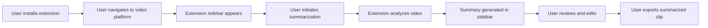

# Video Summarizer Chrome Extension 

## Business Objectives
- Increase user productivity by providing concise video summaries
- Facilitate content creation for short-form video platforms
- Drive user engagement and retention on our platform

## Key Performance Indicators (KPIs)
- Number of active users
Measurement: Track unique user logins per day/week/month through the extension
Tool: Google Analytics for Chrome Extensions

- Video summarization accuracy
Measurement: Implement a 5-star rating system for each summarized video
Tool: Custom feedback mechanism within the extension

- Average time saved per user
Measurement: Compare original video length to summarized video length
Tool: Custom analytics tracking within the extension

- Number of videos summarized
Measurement: Count of successful summarization operations
Tool: Backend database tracking

- Conversion rate from free to premium users
Measurement: (Number of premium conversions / Total free users) * 100
Tool: Customer Relationship Management (CRM) system integration

## User Journey



## Technical Requirements

### Model and Data Requirements
- Natural Language Processing (NLP) model for speech-to-text conversion
- Machine Learning model for content relevance scoring
- Computer Vision model for scene detection and visual summarization

### AWS Architecture
- Amazon Rekognition for pre-processing, technical cues, and shot detection
- Amazon Bedrock (Claude 3) for semantic understanding and post-video merging & slicing
- AWS Step Functions with Lambda for video operations (slicing, merging, subtitle modifications)
- FFmpeg for video processing within Lambda functions

### Chrome Extension Development
- Create manifest.json file, e.g.
```json
{
  "manifest_version": 3,
  "name": "KADA - Video Summarizer",
  "version": "1.0",
  "description": "Summarize and edit videos into short clips",
  "permissions": ["activeTab", "storage", "scripting"],
  "host_permissions": ["*://*.youtube.com/*"],
  "action": {
    "default_icon": {
      "16": "images/icon16.png",
      "48": "images/icon48.png",
      "128": "images/icon128.png"
    }
  },
  "background": {
    "service_worker": "background.js"
  },
  "content_scripts": [
    {
      "matches": ["*://*.youtube.com/*"],
      "js": ["content.js"],
      "css": ["sidebar.css"]
    }
  ]
}
```

- Implement Sidebar for user interactions, the background.js file manages the state of the sidebar (open or closed) and communicates with the content script, the content.js file creates and manages the sidebar DOM element, showing or hiding it based on messages from the background script, the sidebar.css file provides basic styling for the sidebar.
    - Create a sidebar.html file with the necessary UI components (buttons, input boxes, output boxes, guidance)
    - Inject the sidebar into the page using content.js
```javascript
// content.js

let sidebar;

function createSidebar() {
  sidebar = document.createElement('div');
  sidebar.id = 'video-summarizer-sidebar';
  sidebar.innerHTML = `
    <h2>Video Summarizer</h2>
    <button id="summarize-btn">Summarize Video</button>
    <div id="summary-output"></div>
  `;
  document.body.appendChild(sidebar);
}

function toggleSidebar(open) {
  if (!sidebar) {
    createSidebar();
  }
  sidebar.style.display = open ? 'block' : 'none';
}

chrome.runtime.onMessage.addListener((request, sender, sendResponse) => {
  if (request.action === "toggleSidebar") {
    toggleSidebar(request.open);
  }
});

// Check sidebar state on page load
chrome.runtime.sendMessage({ action: "getSidebarState" }, (response) => {
  toggleSidebar(response.open);
}); 
```
```javascript
/* sidebar.css */

#video-summarizer-sidebar {
  position: fixed;
  top: 0;
  right: 0;
  width: 300px;
  height: 100%;
  background-color: white;
  box-shadow: -2px 0 5px rgba(0,0,0,0.2);
  z-index: 9999;
  padding: 20px;
  box-sizing: border-box;
  display: none;
}

#video-summarizer-sidebar h2 {
  margin-top: 0;
}

#summarize-btn {
  display: block;
  width: 100%;
  padding: 10px;
  margin-top: 20px;
  background-color: #4CAF50;
  color: white;
  border: none;
  cursor: pointer;
}

#summary-output {
  margin-top: 20px;
  white-space: pre-wrap;
}
```

- Implement sidebar toggle functionality in background.js
```javascript
// background.js
let sidebarOpen = false;

chrome.action.onClicked.addListener((tab) => {
  if (tab.url.includes("youtube.com")) {
    sidebarOpen = !sidebarOpen;
    chrome.tabs.sendMessage(tab.id, { action: "toggleSidebar", open: sidebarOpen });
  }
});

chrome.runtime.onMessage.addListener((request, sender, sendResponse) => {
  if (request.action === "getSidebarState") {
    sendResponse({ open: sidebarOpen });
  }
});
```

- Integrate with backend APIs for video processing
- Implement video editing capabilities within the extension

### Testing
#### Unit Testing
framework: Jest
sample:
```javascript
// Example Jest test for a utility function
const { calculateTimeSaved } = require('./utils');

test('calculateTimeSaved returns correct value', () => {
  expect(calculateTimeSaved(10, 5)).toBe(5);
});
```

#### Integration Testing
framework: Mocha with Chai assertions
sample:
```javascript
const { expect } = require('chai');
const { initializeSidebar, toggleSidebar } = require('./sidebar');

describe('Sidebar functionality', () => {
  it('should toggle sidebar visibility', () => {
    initializeSidebar();
    const sidebar = document.getElementById('video-summarizer-sidebar');
    expect(sidebar.style.display).to.equal('none');
    toggleSidebar(true);
    expect(sidebar.style.display).to.equal('block');
  });
});
```

#### End-to-End Testing
framework: Puppeteer
sample:
```javascript
const puppeteer = require('puppeteer');

describe('Extension E2E Tests', () => {
  let browser;
  let page;

  beforeAll(async () => {
    browser = await puppeteer.launch({
      headless: false,
      args: [
        `--disable-extensions-except=${PATH_TO_EXTENSION}`,
        `--load-extension=${PATH_TO_EXTENSION}`
      ]
    });
    page = await browser.newPage();
  });

  test('Extension icon appears on YouTube', async () => {
    await page.goto('https://www.youtube.com');
    const extensionIcon = await page.$('.video-summarizer-icon');
    expect(extensionIcon).not.toBeNull();
  });

  afterAll(() => browser.close());
});
```
#### Continuous Integration
framework: GitHub Actions
sample:
```yaml
# .github/workflows/test.yml
name: Test Chrome Extension

on: [push, pull_request]

jobs:
  test:
    runs-on: ubuntu-latest
    steps:
    - uses: actions/checkout@v2
    - name: Use Node.js
      uses: actions/setup-node@v2
      with:
        node-version: '14'
    - run: npm ci
    - run: npm run test:unit
    - run: npm run test:integration
    - run: npm run test:e2e
```

#### Automated Packaging

```javascript
// scripts/package-extension.js
const fs = require('fs');
const archiver = require('archiver');

const output = fs.createWriteStream('extension.zip');
const archive = archiver('zip', { zlib: { level: 9 } });

output.on('close', () => {
  console.log('Extension packaged successfully');
});

archive.on('error', (err) => {
  throw err;
});

archive.pipe(output);
archive.directory('src/', false);
archive.file('manifest.json', { name: 'manifest.json' });
archive.finalize();
```

```json
// package.json
{
  "scripts": {
    "package": "node scripts/package-extension.js"
  }
}
```

```bash
npm run package
```

#### Automated Version Bumping

```javascript
// scripts/bump-version.js
const fs = require('fs');
const manifest = require('../manifest.json');

const [,, versionType] = process.argv;
const [major, minor, patch] = manifest.version.split('.').map(Number);

switch (versionType) {
  case 'major':
    manifest.version = `${major + 1}.0.0`;
    break;
  case 'minor':
    manifest.version = `${major}.${minor + 1}.0`;
    break;
  case 'patch':
  default:
    manifest.version = `${major}.${minor}.${patch + 1}`;
}

fs.writeFileSync('./manifest.json', JSON.stringify(manifest, null, 2));
console.log(`Version bumped to ${manifest.version}`);
```

```
{
  "scripts": {
    "bump:patch": "node scripts/bump-version.js patch",
    "bump:minor": "node scripts/bump-version.js minor",
    "bump:major": "node scripts/bump-version.js major"
  }
}
```

## Chrome Extension Publication Process
- Test the extension thoroughly and package it, for more refer to the 
- Create a developer account on Chrome Web Store
- Submit the extension for review
- Respond to any feedback from the Chrome Web Store team
- Publish the extension once approved

## Risk Mitigation and Compliance
- Implement robust data encryption for user privacy
- Ensure compliance with GDPR and CCPA regulations
- Obtain necessary licenses for video manipulation and distribution
- Implement rate limiting to prevent abuse of the service

## Go-to-Market Strategy
- Soft launch with limited features to gather user feedback
- Implement a freemium model with basic features free and advanced features paid
- Launch targeted social media campaigns on platforms like Twitter and LinkedIn
- Engage with tech and productivity communities on Reddit and Product Hunt
- Optimize Chrome Web Store listing for discoverability
- Offer a 14-day free trial of premium features to encourage upgrades